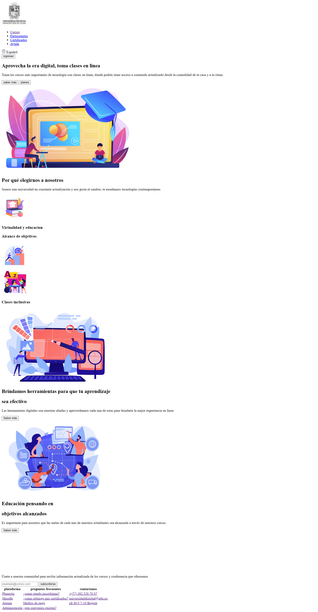
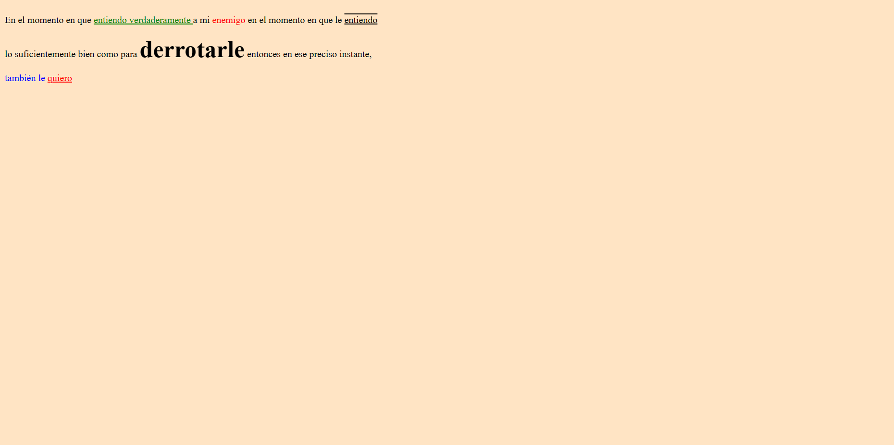
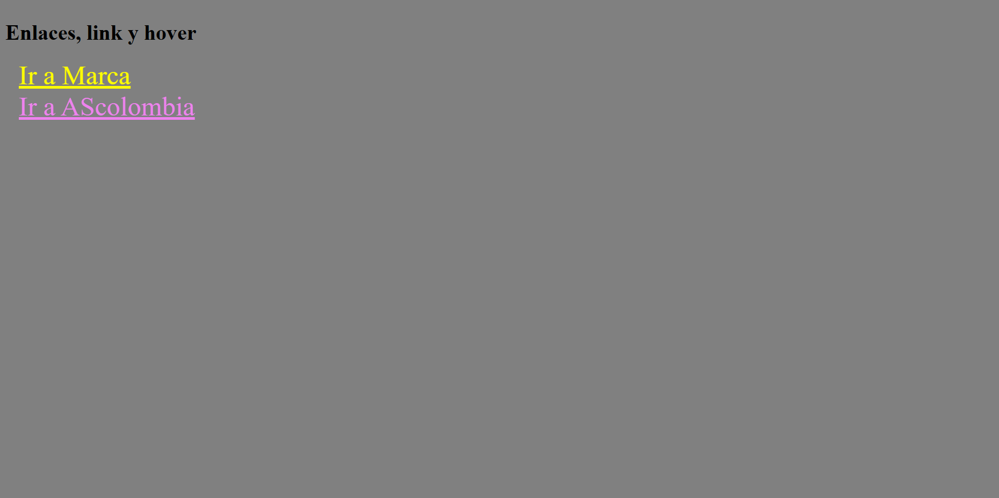
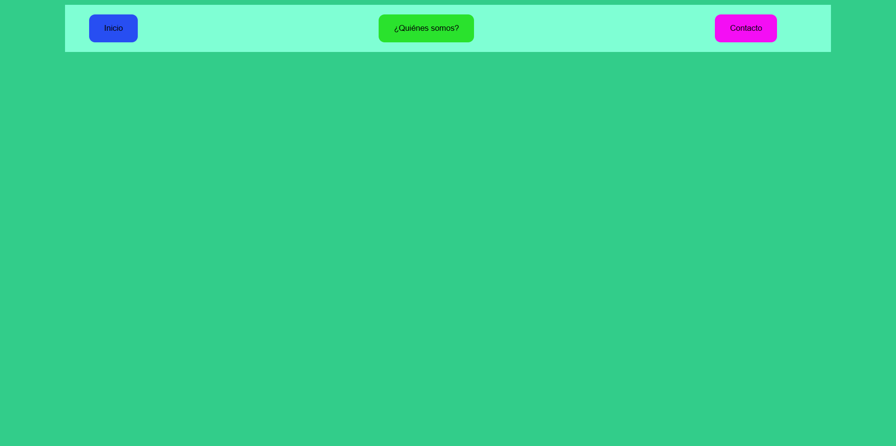
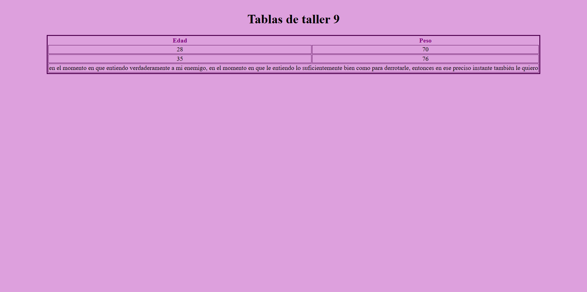

<h1> Taller 9 - Daniel Felipe Matallana Santacoloma </h1>
<h2>Información</h2>

Curso: Full Stack Basico  - Grupo 1

Profesor: Cristian Patiño 

<h2>link de la pagina web</h2>
<a href="https://felipematallana696.github.io/taller_9-full-stack-g1/">Link de Pagina web </a>

<h2>link de figma</h2>
<a href="https://www.figma.com/files/project/111460883/Team-project?fuid=1294091732711267271">Link de figma </a>

<h2> punto 2: diseño en HTML </h2>

<h2> punto 3: diseño en CSS </h2>

<h2> punto 4: Titulos </h2>

<h2> punto 5: Párrafos </h2>

<h2> punto 6: Links </h2>

<h2> punto 7 y 8 : Navegación </h2>

<h2> punto 9: Tabla </h2>
